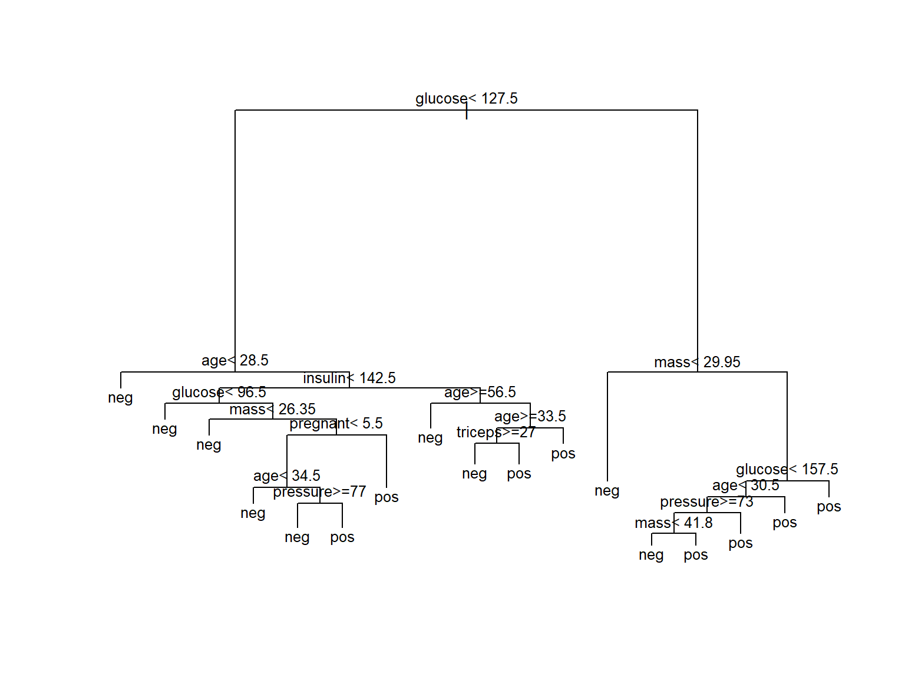
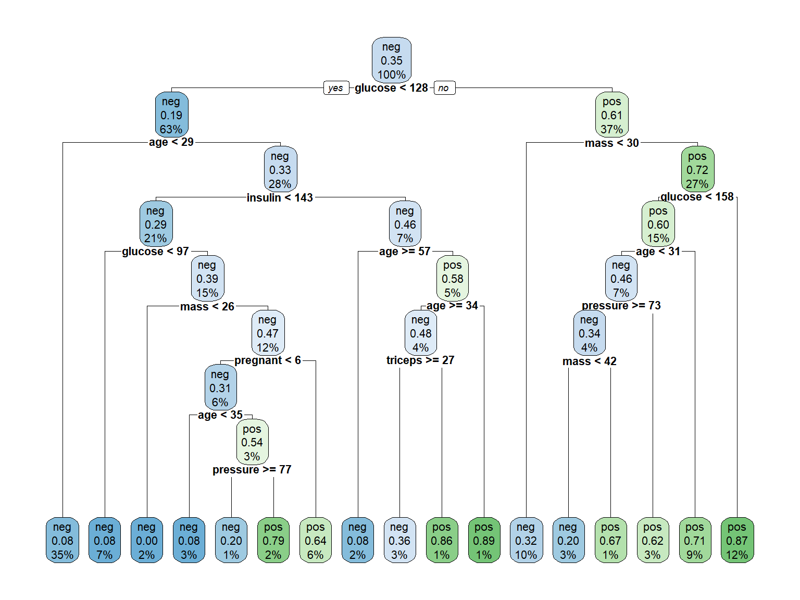
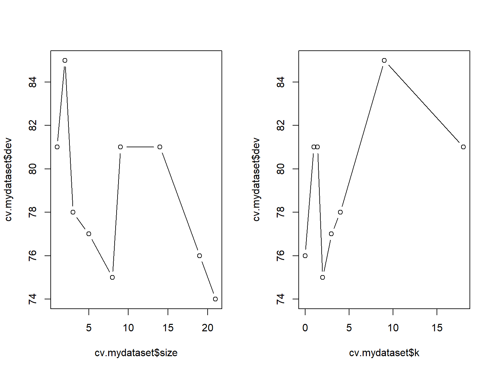
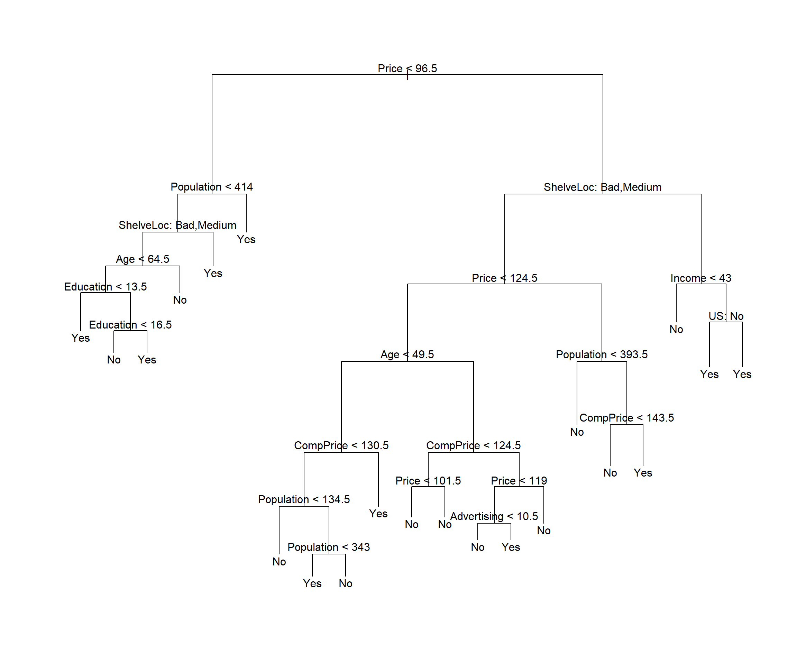
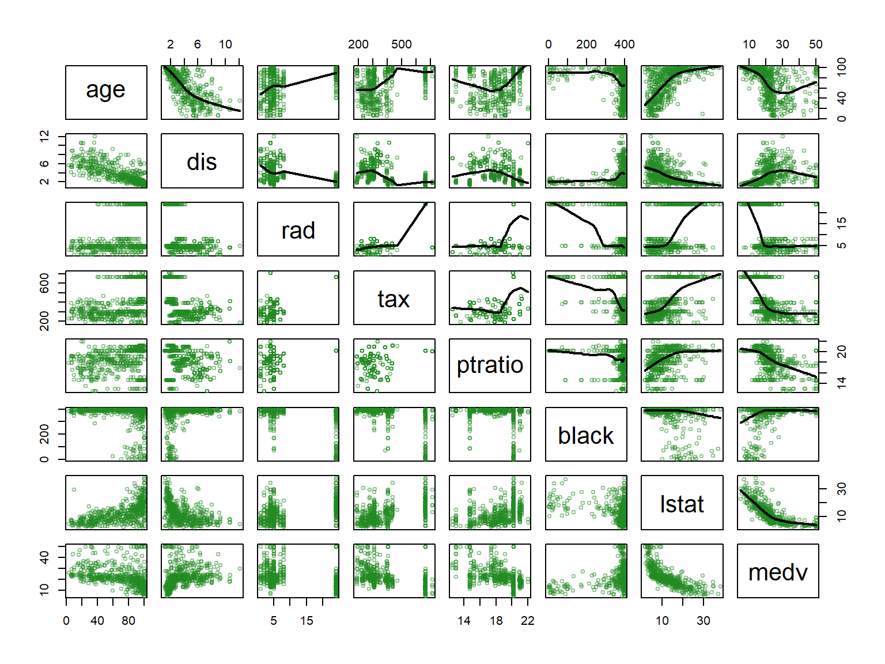
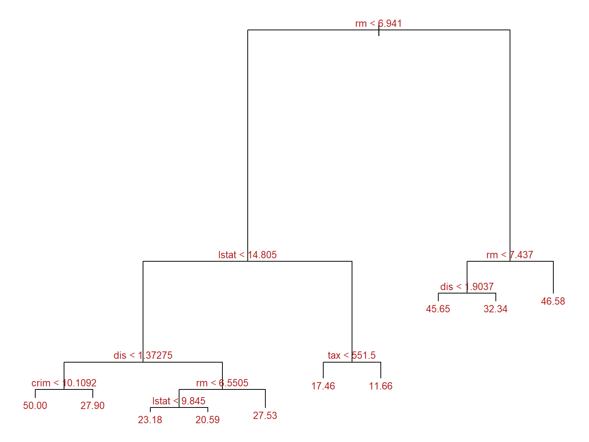
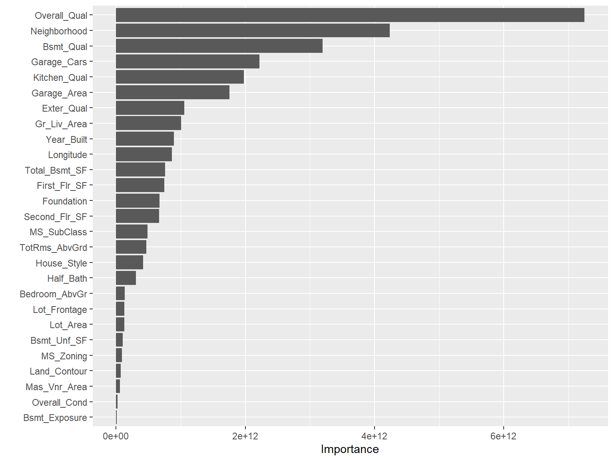

::: {.cell}

```{.r .cell-code}
# This chunk is used to do the assignment of values to R variables
# This code must be adapted to any change of datasets or 

myDescription <- "The data are a simulated data set containing sales of child car seats at different stores [@james2013introduction]"
mydataset <- Carseats
```
:::

::: {.cell}

```{.r .cell-code}
n <- nrow(mydataset)
p <- ncol(mydataset)
```
:::


# Introductory example

## The Pima Indians dataset

The Pima Indian Diabetes data set (`PimaIndiansDiabetes2`) is available in the `mlbench` package.

The data contains 768 individuals (female) and 9 clinical variables for predicting the probability of individuals in being diabete-positive or negative:

-   pregnant: number of times pregnant
-   glucose: plasma glucose concentration
-   pressure: diastolic blood pressure (mm Hg)
-   triceps: triceps skin fold thickness (mm)
-   insulin: 2-Hour serum insulin (mu U/ml)
-   mass: body mass index (weight in kg/(height in m)\^2)
-   pedigree: diabetes pedigree function
-   age: age (years)
-   diabetes: class variable

A typical classification/prediction problem is to build a model that can distinguish and predict diabetes using some or all the variables in the dataset.

A quick exploration can be done wirh the `swirl` package:


::: {.cell}

```{.r .cell-code}
library(skimr)
data("PimaIndiansDiabetes2", package = "mlbench")
skim(PimaIndiansDiabetes2)
```

::: {.cell-output-display}
Table: Data summary

|                         |                     |
|:------------------------|:--------------------|
|Name                     |PimaIndiansDiabetes2 |
|Number of rows           |768                  |
|Number of columns        |9                    |
|_______________________  |                     |
|Column type frequency:   |                     |
|factor                   |1                    |
|numeric                  |8                    |
|________________________ |                     |
|Group variables          |None                 |


**Variable type: factor**

|skim_variable | n_missing| complete_rate|ordered | n_unique|top_counts         |
|:-------------|---------:|-------------:|:-------|--------:|:------------------|
|diabetes      |         0|             1|FALSE   |        2|neg: 500, pos: 268 |


**Variable type: numeric**

|skim_variable | n_missing| complete_rate|   mean|     sd|    p0|   p25|    p50|    p75|   p100|hist  |
|:-------------|---------:|-------------:|------:|------:|-----:|-----:|------:|------:|------:|:-----|
|pregnant      |         0|          1.00|   3.85|   3.37|  0.00|  1.00|   3.00|   6.00|  17.00|▇▃▂▁▁ |
|glucose       |         5|          0.99| 121.69|  30.54| 44.00| 99.00| 117.00| 141.00| 199.00|▁▇▇▃▂ |
|pressure      |        35|          0.95|  72.41|  12.38| 24.00| 64.00|  72.00|  80.00| 122.00|▁▃▇▂▁ |
|triceps       |       227|          0.70|  29.15|  10.48|  7.00| 22.00|  29.00|  36.00|  99.00|▆▇▁▁▁ |
|insulin       |       374|          0.51| 155.55| 118.78| 14.00| 76.25| 125.00| 190.00| 846.00|▇▂▁▁▁ |
|mass          |        11|          0.99|  32.46|   6.92| 18.20| 27.50|  32.30|  36.60|  67.10|▅▇▃▁▁ |
|pedigree      |         0|          1.00|   0.47|   0.33|  0.08|  0.24|   0.37|   0.63|   2.42|▇▃▁▁▁ |
|age           |         0|          1.00|  33.24|  11.76| 21.00| 24.00|  29.00|  41.00|  81.00|▇▃▁▁▁ |
:::
:::


## Building a classification tree with \`rpart\`\`

Start building a simple tree with default parameters


::: {.cell}

```{.r .cell-code}
library(rpart)
model1 <- rpart(diabetes ~., data = PimaIndiansDiabetes2)
# par(xpd = NA) # otherwise on some devices the text is clipped
```
:::


This builds a model consisting of a series of nested decision rules.


::: {.cell}

```{.r .cell-code}
print(model1)
```

::: {.cell-output .cell-output-stdout}
```
n= 768 

node), split, n, loss, yval, (yprob)
      * denotes terminal node

  1) root 768 268 neg (0.65104167 0.34895833)  
    2) glucose< 127.5 485  94 neg (0.80618557 0.19381443)  
      4) age< 28.5 271  23 neg (0.91512915 0.08487085) *
      5) age>=28.5 214  71 neg (0.66822430 0.33177570)  
       10) insulin< 142.5 164  48 neg (0.70731707 0.29268293)  
         20) glucose< 96.5 51   4 neg (0.92156863 0.07843137) *
         21) glucose>=96.5 113  44 neg (0.61061947 0.38938053)  
           42) mass< 26.35 19   0 neg (1.00000000 0.00000000) *
           43) mass>=26.35 94  44 neg (0.53191489 0.46808511)  
             86) pregnant< 5.5 49  15 neg (0.69387755 0.30612245)  
              172) age< 34.5 25   2 neg (0.92000000 0.08000000) *
              173) age>=34.5 24  11 pos (0.45833333 0.54166667)  
                346) pressure>=77 10   2 neg (0.80000000 0.20000000) *
                347) pressure< 77 14   3 pos (0.21428571 0.78571429) *
             87) pregnant>=5.5 45  16 pos (0.35555556 0.64444444) *
       11) insulin>=142.5 50  23 neg (0.54000000 0.46000000)  
         22) age>=56.5 12   1 neg (0.91666667 0.08333333) *
         23) age< 56.5 38  16 pos (0.42105263 0.57894737)  
           46) age>=33.5 29  14 neg (0.51724138 0.48275862)  
             92) triceps>=27 22   8 neg (0.63636364 0.36363636) *
             93) triceps< 27 7   1 pos (0.14285714 0.85714286) *
           47) age< 33.5 9   1 pos (0.11111111 0.88888889) *
    3) glucose>=127.5 283 109 pos (0.38515901 0.61484099)  
      6) mass< 29.95 75  24 neg (0.68000000 0.32000000) *
      7) mass>=29.95 208  58 pos (0.27884615 0.72115385)  
       14) glucose< 157.5 116  46 pos (0.39655172 0.60344828)  
         28) age< 30.5 50  23 neg (0.54000000 0.46000000)  
           56) pressure>=73 29  10 neg (0.65517241 0.34482759)  
            112) mass< 41.8 20   4 neg (0.80000000 0.20000000) *
            113) mass>=41.8 9   3 pos (0.33333333 0.66666667) *
           57) pressure< 73 21   8 pos (0.38095238 0.61904762) *
         29) age>=30.5 66  19 pos (0.28787879 0.71212121) *
       15) glucose>=157.5 92  12 pos (0.13043478 0.86956522) *
```
:::
:::


The model can be visualized using a tree:


::: {.cell}

```{.r .cell-code}
plot(model1)
text(model1, digits = 3, cex=0.8)
```

::: {.cell-output-display}
{width=768}
:::
:::


A nicer plot can be obtained using the `rpart.plot` function from the `rpart.plot` package. This function allows for multiple tunings, but the default values may already yield a nice informative plot.


::: {.cell}

```{.r .cell-code}
rpart.plot(model1, cex=.7)
```

::: {.cell-output-display}
{width=768}
:::

```{.r .cell-code}
detach(package:rpart.plot)
```
:::


If we believed the model was ready for use we could use it to predict diabetes for new subject.

**Imagine we kow nothing about overfitting**. We may want to check the accuracy of the model on the dataset we have used to build it.


::: {.cell}

```{.r .cell-code}
predicted.classes<- predict(model1, PimaIndiansDiabetes2, "class")
mean(predicted.classes == PimaIndiansDiabetes2$diabetes)
```

::: {.cell-output .cell-output-stdout}
```
[1] 0.8294271
```
:::
:::


A better strategy is to use train dataset to build the model and a test dataset to check how it works.


::: {.cell}

```{.r .cell-code}
set.seed(123)
ssize <- nrow(PimaIndiansDiabetes2)
propTrain <- 0.8
training.indices <-sample(1:ssize, floor(ssize*propTrain))
train.data  <- PimaIndiansDiabetes2[training.indices, ]
test.data <- PimaIndiansDiabetes2[-training.indices, ]
```
:::


Now we build the model on the train data and check its accuracy on the test data.


::: {.cell}

```{.r .cell-code}
model2 <- rpart(diabetes ~., data = train.data)
predicted.classes.test<- predict(model2, test.data, "class")
mean(predicted.classes.test == test.data$diabetes)
```

::: {.cell-output .cell-output-stdout}
```
[1] 0.7272727
```
:::
:::


The accuracy is good, but smaller, as expected.

# A classification tree

## Data description

------------------------------------------------------------------------

*In this section, you should provide a short explanation about problem and the data set.*

------------------------------------------------------------------------

The data are a simulated data set containing sales of child car seats at different stores [@james2013introduction].

The data set has **400** observations on **11** variables. The variable names are: *Sales, CompPrice, Income, Advertising, Population, Price, ShelveLoc, Age, Education, Urban, US*.

We start categorizing the variable `Sales` creating a new variable, `High`, which takes on a value of `Yes` if the `Sales` variable exceeds 8, and a value of `No` otherwise.


::: {.cell}

```{.r .cell-code}
# as.factor() changes the type of variable to factor
mydataset$High=as.factor(ifelse(mydataset$Sales<=8,"No","Yes"))
```
:::


The number of observations for each class is:


::: {.cell}

```{.r .cell-code}
kable(table(mydataset$High), caption= "Number of observations for each class", col.names = c('High','Freq'))
```

::: {.cell-output-display}
Table: Number of observations for each class

|High | Freq|
|:----|----:|
|No   |  236|
|Yes  |  164|
:::
:::


The aim is of this study is to predict the categorical values of sales (`High`) using all variables but `Sales`.

It is a classification problem and we will build a *classification tree model*.

### Data summarization

This is a short data set summary


::: {.cell}

```{.r .cell-code}
summary(mydataset)
```

::: {.cell-output .cell-output-stdout}
```
     Sales          CompPrice       Income        Advertising    
 Min.   : 0.000   Min.   : 77   Min.   : 21.00   Min.   : 0.000  
 1st Qu.: 5.390   1st Qu.:115   1st Qu.: 42.75   1st Qu.: 0.000  
 Median : 7.490   Median :125   Median : 69.00   Median : 5.000  
 Mean   : 7.496   Mean   :125   Mean   : 68.66   Mean   : 6.635  
 3rd Qu.: 9.320   3rd Qu.:135   3rd Qu.: 91.00   3rd Qu.:12.000  
 Max.   :16.270   Max.   :175   Max.   :120.00   Max.   :29.000  
   Population        Price        ShelveLoc        Age          Education   
 Min.   : 10.0   Min.   : 24.0   Bad   : 96   Min.   :25.00   Min.   :10.0  
 1st Qu.:139.0   1st Qu.:100.0   Good  : 85   1st Qu.:39.75   1st Qu.:12.0  
 Median :272.0   Median :117.0   Medium:219   Median :54.50   Median :14.0  
 Mean   :264.8   Mean   :115.8                Mean   :53.32   Mean   :13.9  
 3rd Qu.:398.5   3rd Qu.:131.0                3rd Qu.:66.00   3rd Qu.:16.0  
 Max.   :509.0   Max.   :191.0                Max.   :80.00   Max.   :18.0  
 Urban       US       High    
 No :118   No :142   No :236  
 Yes:282   Yes:258   Yes:164  
                              
                              
                              
                              
```
:::
:::


An improved description:


::: {.cell}

```{.r .cell-code}
skimr::skim(mydataset)
```

::: {.cell-output-display}
Table: Data summary

|                         |          |
|:------------------------|:---------|
|Name                     |mydataset |
|Number of rows           |400       |
|Number of columns        |12        |
|_______________________  |          |
|Column type frequency:   |          |
|factor                   |4         |
|numeric                  |8         |
|________________________ |          |
|Group variables          |None      |


**Variable type: factor**

|skim_variable | n_missing| complete_rate|ordered | n_unique|top_counts                 |
|:-------------|---------:|-------------:|:-------|--------:|:--------------------------|
|ShelveLoc     |         0|             1|FALSE   |        3|Med: 219, Bad: 96, Goo: 85 |
|Urban         |         0|             1|FALSE   |        2|Yes: 282, No: 118          |
|US            |         0|             1|FALSE   |        2|Yes: 258, No: 142          |
|High          |         0|             1|FALSE   |        2|No: 236, Yes: 164          |


**Variable type: numeric**

|skim_variable | n_missing| complete_rate|   mean|     sd| p0|    p25|    p50|    p75|   p100|hist  |
|:-------------|---------:|-------------:|------:|------:|--:|------:|------:|------:|------:|:-----|
|Sales         |         0|             1|   7.50|   2.82|  0|   5.39|   7.49|   9.32|  16.27|▁▆▇▃▁ |
|CompPrice     |         0|             1| 124.97|  15.33| 77| 115.00| 125.00| 135.00| 175.00|▁▅▇▃▁ |
|Income        |         0|             1|  68.66|  27.99| 21|  42.75|  69.00|  91.00| 120.00|▇▆▇▆▅ |
|Advertising   |         0|             1|   6.64|   6.65|  0|   0.00|   5.00|  12.00|  29.00|▇▃▃▁▁ |
|Population    |         0|             1| 264.84| 147.38| 10| 139.00| 272.00| 398.50| 509.00|▇▇▇▇▇ |
|Price         |         0|             1| 115.80|  23.68| 24| 100.00| 117.00| 131.00| 191.00|▁▂▇▆▁ |
|Age           |         0|             1|  53.32|  16.20| 25|  39.75|  54.50|  66.00|  80.00|▇▆▇▇▇ |
|Education     |         0|             1|  13.90|   2.62| 10|  12.00|  14.00|  16.00|  18.00|▇▇▃▇▇ |
:::
:::


## Preprocess

------------------------------------------------------------------------

*It is very common that the data need to be preprocessed before training the model*

------------------------------------------------------------------------

In this case, no cleaning or preprocessing are required.

## Train/Test partition of data

In order to properly evaluate the performance of a model, we must estimate the error rather than simply computing the training error.

We

1.  split the observations into a training set and a test set,
2.  build the model using the training set, and
3.  evaluate its performance on the test data.


::: {.cell}

```{.r .cell-code}
set.seed(2)
pt <- 1/2
train <- sample(1:nrow(mydataset),pt*nrow(mydataset))
mydataset.test <- mydataset[-train,]
High.test <-  mydataset[-train,"High"]
```
:::


The train and tets set have 200 200 observations respectively.

In train data, the number of observations for each class is:


::: {.cell}

```{.r .cell-code}
kable(table(mydataset[train,"High"]), caption= "Train data: number of observations for each class",
      col.names = c('High','Freq'))
```

::: {.cell-output-display}
Table: Train data: number of observations for each class

|High | Freq|
|:----|----:|
|No   |  119|
|Yes  |   81|
:::
:::


## Train model

We now use the `tree()` function to fit a classification tree in order to predict `High` using all variables but `Sales` using only de train set.


::: {.cell}

```{.r .cell-code}
tree.mydataset=tree(High~.-Sales, mydataset,
                    subset=train, split="deviance")
tree.mydataset2=rpart(High~.-Sales, mydataset,
                    subset=train)
```
:::


The `summary()` function lists the variables that are used as internal nodes in the tree, the number of terminal nodes, and the **training** error rate


::: {.cell}

```{.r .cell-code}
summary(tree.mydataset)
```

::: {.cell-output .cell-output-stdout}
```

Classification tree:
tree(formula = High ~ . - Sales, data = mydataset, subset = train, 
    split = "deviance")
Variables actually used in tree construction:
[1] "Price"       "Population"  "ShelveLoc"   "Age"         "Education"  
[6] "CompPrice"   "Advertising" "Income"      "US"         
Number of terminal nodes:  21 
Residual mean deviance:  0.5543 = 99.22 / 179 
Misclassification error rate: 0.115 = 23 / 200 
```
:::

```{.r .cell-code}
# summary(tree.mydataset2)
```
:::


We can thus define the deviance of a tree (roughly equivalent to the concept of impurity) as the sum over all leaves of:

$$
-2 \sum_m \sum_k n_{mk} log(\hat{p}_{mk}),
$$

where $n_{mk}$ is the number of observations in the `m`th terminal node that belong to the `k`th class. The *residual mean deviance* reported is simply the deviance divided by $n - |T_0|$ where $T_0$ is the number of terminal nodes.

## Plot the Tree

The next step is display the tree graphically. We use the `plot()` function to display the tree structure, and the `text()`function to display the node labels.


::: {.cell}

```{.r .cell-code}
# plot(tree.mydataset)
# require(rpart.plot)
# rpart.plot(tree.mydataset2)
# text(tree.mydataset,pretty=0)
```
:::


It is also possible to show a `R` print output corresponding to each branch of the tree.


::: {.cell}

```{.r .cell-code}
tree.mydataset
```

::: {.cell-output .cell-output-stdout}
```
node), split, n, deviance, yval, (yprob)
      * denotes terminal node

  1) root 200 270.000 No ( 0.59500 0.40500 )  
    2) Price < 96.5 40  47.050 Yes ( 0.27500 0.72500 )  
      4) Population < 414 31  40.320 Yes ( 0.35484 0.64516 )  
        8) ShelveLoc: Bad,Medium 25  34.300 Yes ( 0.44000 0.56000 )  
         16) Age < 64.5 17  20.600 Yes ( 0.29412 0.70588 )  
           32) Education < 13.5 7   0.000 Yes ( 0.00000 1.00000 ) *
           33) Education > 13.5 10  13.860 Yes ( 0.50000 0.50000 )  
             66) Education < 16.5 5   5.004 No ( 0.80000 0.20000 ) *
             67) Education > 16.5 5   5.004 Yes ( 0.20000 0.80000 ) *
         17) Age > 64.5 8   8.997 No ( 0.75000 0.25000 ) *
        9) ShelveLoc: Good 6   0.000 Yes ( 0.00000 1.00000 ) *
      5) Population > 414 9   0.000 Yes ( 0.00000 1.00000 ) *
    3) Price > 96.5 160 201.800 No ( 0.67500 0.32500 )  
      6) ShelveLoc: Bad,Medium 135 154.500 No ( 0.74074 0.25926 )  
       12) Price < 124.5 82 107.700 No ( 0.63415 0.36585 )  
         24) Age < 49.5 34  45.230 Yes ( 0.38235 0.61765 )  
           48) CompPrice < 130.5 21  28.680 No ( 0.57143 0.42857 )  
             96) Population < 134.5 6   0.000 No ( 1.00000 0.00000 ) *
             97) Population > 134.5 15  20.190 Yes ( 0.40000 0.60000 )  
              194) Population < 343 7   5.742 Yes ( 0.14286 0.85714 ) *
              195) Population > 343 8  10.590 No ( 0.62500 0.37500 ) *
           49) CompPrice > 130.5 13   7.051 Yes ( 0.07692 0.92308 ) *
         25) Age > 49.5 48  46.330 No ( 0.81250 0.18750 )  
           50) CompPrice < 124.5 28  14.410 No ( 0.92857 0.07143 )  
            100) Price < 101.5 8   8.997 No ( 0.75000 0.25000 ) *
            101) Price > 101.5 20   0.000 No ( 1.00000 0.00000 ) *
           51) CompPrice > 124.5 20  25.900 No ( 0.65000 0.35000 )  
            102) Price < 119 14  19.410 No ( 0.50000 0.50000 )  
              204) Advertising < 10.5 9  11.460 No ( 0.66667 0.33333 ) *
              205) Advertising > 10.5 5   5.004 Yes ( 0.20000 0.80000 ) *
            103) Price > 119 6   0.000 No ( 1.00000 0.00000 ) *
       13) Price > 124.5 53  33.120 No ( 0.90566 0.09434 )  
         26) Population < 393.5 34   0.000 No ( 1.00000 0.00000 ) *
         27) Population > 393.5 19  21.900 No ( 0.73684 0.26316 )  
           54) CompPrice < 143.5 13   7.051 No ( 0.92308 0.07692 ) *
           55) CompPrice > 143.5 6   7.638 Yes ( 0.33333 0.66667 ) *
      7) ShelveLoc: Good 25  31.340 Yes ( 0.32000 0.68000 )  
       14) Income < 43 7   8.376 No ( 0.71429 0.28571 ) *
       15) Income > 43 18  16.220 Yes ( 0.16667 0.83333 )  
         30) US: No 6   8.318 Yes ( 0.50000 0.50000 ) *
         31) US: Yes 12   0.000 Yes ( 0.00000 1.00000 ) *
```
:::
:::


## Prediction

We now evaluate the performance of the classification tree on the test data. The `predict()` function can be used for this purpose.


::: {.cell}

```{.r .cell-code}
tree.pred=predict(tree.mydataset,mydataset.test,type="class")
res <- table(tree.pred,High.test)
res
```

::: {.cell-output .cell-output-stdout}
```
         High.test
tree.pred  No Yes
      No  104  31
      Yes  13  52
```
:::

```{.r .cell-code}
accrcy <- sum(diag(res)/sum(res))
```
:::


The accuracy is **0.78** or misclassification error rate is **0.22**.

## Prune the tree (Tunning model)

We consider whether pruning the tree could lead to improved results.


::: {.cell}

```{.r .cell-code}
set.seed(3)
cv.mydataset=cv.tree(tree.mydataset,FUN=prune.misclass)
names(cv.mydataset)
```

::: {.cell-output .cell-output-stdout}
```
[1] "size"   "dev"    "k"      "method"
```
:::

```{.r .cell-code}
cv.mydataset
```

::: {.cell-output .cell-output-stdout}
```
$size
[1] 21 19 14  9  8  5  3  2  1

$dev
[1] 74 76 81 81 75 77 78 85 81

$k
[1] -Inf  0.0  1.0  1.4  2.0  3.0  4.0  9.0 18.0

$method
[1] "misclass"

attr(,"class")
[1] "prune"         "tree.sequence"
```
:::
:::


Note that, despite the name, `dev` corresponds to the cross-validation error rate in this instance.

We plot the error rate as a function of both `size`and `k`.


::: {.cell}

```{.r .cell-code}
par(mfrow=c(1,2))
plot(cv.mydataset$size,cv.mydataset$dev,type="b")
plot(cv.mydataset$k,cv.mydataset$dev,type="b")
```

::: {.cell-output-display}
{width=768}
:::

```{.r .cell-code}
par(mfrow=c(1,1))
```
:::


We now apply the `prune.misclass()` function in order to prune the tree to obtain a "best tree". The best tree is the tree with ...


::: {.cell}

```{.r .cell-code}
prune.mydataset=prune.misclass(tree.mydataset,
                               best=cv.mydataset$size[which.min(cv.mydataset$dev)])
plot(prune.mydataset)
text(prune.mydataset,pretty=0)
```

::: {.cell-output-display}
{width=1152}
:::
:::


How well does this pruned tree perform on the test data set?


::: {.cell}

```{.r .cell-code}
tree.pred=predict(prune.mydataset,mydataset.test,type="class")
res <- table(tree.pred,High.test)
res
```

::: {.cell-output .cell-output-stdout}
```
         High.test
tree.pred  No Yes
      No  104  32
      Yes  13  51
```
:::

```{.r .cell-code}
accrcy <- sum(diag(res)/sum(res))
```
:::


The accuracy is **0.775**.

If we increase the value of `best`, for example 21 terminal nodes, we obtain a larger pruned tree with lower classification accuracy:


::: {.cell}

```{.r .cell-code}
prune.mydataset=prune.misclass(tree.mydataset, 
                               best = cv.mydataset$size[1])
plot(prune.mydataset)
text(prune.mydataset, pretty=0)
```

::: {.cell-output-display}
{width=1152}
:::
:::

::: {.cell}

```{.r .cell-code}
tree.pred=predict(prune.mydataset, mydataset.test, type="class")
res <- table(tree.pred, High.test)
res
```

::: {.cell-output .cell-output-stdout}
```
         High.test
tree.pred  No Yes
      No  105  31
      Yes  12  52
```
:::

```{.r .cell-code}
accrcy <- sum(diag(res)/sum(res))
```
:::


The accuracy is **0.785**.

# A regression tree example

This example is borrowed from [@amat2017].

The Boston dataset available in the MASS package contains housing prices for the city of Boston, as well as socioeconomic information for the neighborhood in which they are located.


::: {.cell}

```{.r .cell-code}
library(MASS)
data("Boston")
datos <- Boston
head(datos, 3)
```

::: {.cell-output .cell-output-stdout}
```
     crim zn indus chas   nox    rm  age    dis rad tax ptratio  black lstat
1 0.00632 18  2.31    0 0.538 6.575 65.2 4.0900   1 296    15.3 396.90  4.98
2 0.02731  0  7.07    0 0.469 6.421 78.9 4.9671   2 242    17.8 396.90  9.14
3 0.02729  0  7.07    0 0.469 7.185 61.1 4.9671   2 242    17.8 392.83  4.03
  medv
1 24.0
2 21.6
3 34.7
```
:::
:::


Our goal is to fit a regression model that allows predicting the average price of a home (medv) based on the available variables.


::: {.cell layout-align="center"}

```{.r .cell-code}
color <- adjustcolor("forestgreen", alpha.f = 0.5)
ps <- function(x, y, ...) {  # custom panel function
  panel.smooth(x, y, col = color, col.smooth = "black", 
               cex = 0.7, lwd = 2)
}
pairs(datos[,c(1:6,14)], cex = 0.7, upper.panel = ps, col = color)
```

::: {.cell-output-display}
{fig-align='center' width=768}
:::

```{.r .cell-code}
pairs(datos[,c(7:14)], cex = 0.7, upper.panel = ps, col = color)
```

::: {.cell-output-display}
{fig-align='center' width=768}
:::
:::


## Model fitting

Create a train and test sets


::: {.cell}

```{.r .cell-code}
set.seed(123)
train <- sample(1:nrow(datos), size = nrow(datos)/2)
datos_train <- datos[train,]
datos_test  <- datos[-train,]
```
:::


We use the `tree` function of the `tree` package to build the model. This function grows the tree until it meets a stop condition. By default, these conditions are:

-   `mincut`: minimum number of observations that at least one of the child nodes must have for the division to occur.
-   `minsize`: minimum number of observations a node must have in order for it to be split.


::: {.cell}

```{.r .cell-code}
set.seed(123)
arbol_regresion <- tree::tree(
                    formula = medv ~ .,
                    data    = datos_train,
                    split   = "deviance",
                    mincut  = 20,
                    minsize = 50
                  )
summary(arbol_regresion)
```

::: {.cell-output .cell-output-stdout}
```

Regression tree:
tree::tree(formula = medv ~ ., data = datos_train, split = "deviance", 
    mincut = 20, minsize = 50)
Variables actually used in tree construction:
[1] "rm"    "lstat" "dis"   "tax"  
Number of terminal nodes:  6 
Residual mean deviance:  20.56 = 5078 / 247 
Distribution of residuals:
    Min.  1st Qu.   Median     Mean  3rd Qu.     Max. 
-14.5500  -2.8680  -0.3628   0.0000   2.0050  22.1300 
```
:::
:::


The `summary` shows that the trained tree has a total of 6 terminal nodes and that the variables `rm, lstat, dis` and `tax` have been used as predictors.

In the context of regression trees, the `Residual mean deviance` term is the residual sum of squares divided by (number of observations - number of terminal nodes). The smaller the deviation, the better the fit of the tree to the training observations.

The tree can be visualized:


::: {.cell}

```{.r .cell-code}
par(mar = c(1,1,1,1))
plot(x = arbol_regresion, type = "proportional")
text(x = arbol_regresion, splits = TRUE, pretty = 0, cex = 0.8, col = "firebrick")
```

::: {.cell-output-display}
{width=768}
:::
:::


## Prunning the tree

We use the `cv.tree` function that uses cross validation to identify the optimal penalty value. By default, this function relies on the *deviance* to guide the pruning process.

We **grow the tree again** so we have a big tree to prune:


::: {.cell}

```{.r .cell-code}
arbol_regresion <- tree::tree(
                    formula = medv ~ .,
                    data    = datos_train,
                    split   = "deviance",
                    mincut  = 1,
                    minsize = 2,
                    mindev  = 0
                  )

# Optimization
set.seed(123)
cv_arbol <- tree::cv.tree(arbol_regresion, K = 5)
```
:::


The function returns an object `cv_arbol` containing:

-   `size`: The size (number of terminal nodes) of each tree.
-   `dev`: The cross-validation test error estimate for each tree size.
-   `k`: The range of penalty values $\alpha$ evaluated.
-   `method`: The criteria used to select the best tree.

These can be used to visualize and understand the optimization performed.


::: {.cell}

```{.r .cell-code}
size_optimo <- rev(cv_arbol$size)[which.min(rev(cv_arbol$dev))]
paste("Optimal size obtained is:", size_optimo)
```

::: {.cell-output .cell-output-stdout}
```
[1] "Optimal size obtained is: 10"
```
:::
:::

::: {.cell}

```{.r .cell-code}
library(ggplot2)
library(ggpubr)


resultados_cv <- data.frame(
                   n_nodes  = cv_arbol$size,
                   deviance = cv_arbol$dev,
                   alpha    = cv_arbol$k
                 )

p1 <- ggplot(data = resultados_cv, aes(x = n_nodes, y = deviance)) +
      geom_line() + 
      geom_point() +
      geom_vline(xintercept = size_optimo, color = "red") +
      labs(title = "Error vs tree size") +
      theme_bw() 
  
p2 <- ggplot(data = resultados_cv, aes(x = alpha, y = deviance)) +
      geom_line() + 
      geom_point() +
      labs(title = "Error vs penalization (alpha)") +
      theme_bw() 

ggarrange(p1, p2)
```

::: {.cell-output-display}
{width=768}
:::
:::


Once the optimal value identified, the final pruning is applied with the `prune.tree` function. This function also accepts the optimal value of $\alpha$ instead of size.


::: {.cell}

```{.r .cell-code}
arbol_final <- tree::prune.tree(
                  tree = arbol_regresion,
                  best = size_optimo
               )

par(mar = c(1,1,1,1))
plot(x = arbol_final, type = "proportional")
text(x = arbol_final, splits = TRUE, pretty = 0, cex = 0.8, col = "firebrick")
```

::: {.cell-output-display}
{width=768}
:::
:::


## Predicting with the model

We can use both, original and pruned trees to predict the data for the test set.

The quality of the prediction is based in the Root Mean Square.

For the original tree one has:


::: {.cell}

```{.r .cell-code}
predicciones <- predict(arbol_regresion, newdata = datos_test)
test_rmse    <- sqrt(mean((predicciones - datos_test$medv)^2))
paste("Error de test (rmse) del árbol inicial:", round(test_rmse,2))
```

::: {.cell-output .cell-output-stdout}
```
[1] "Error de test (rmse) del árbol inicial: 5.43"
```
:::
:::


And for the final tree:


::: {.cell}

```{.r .cell-code}
predicciones_finales <- predict(arbol_final, newdata = datos_test)
test_rmse    <- sqrt(mean((predicciones - datos_test$medv)^2))
paste("Error de test (rmse) del árbol final:", round(test_rmse,2))
```

::: {.cell-output .cell-output-stdout}
```
[1] "Error de test (rmse) del árbol final: 5.43"
```
:::
:::


# Alternative packages for CART

## Comparison between `caret` and `rpart`

Two popular frames for working with trees are the `cart`and the `rpart` packages. The former is focused on decision trees, while the firs is a generic framework to perform any type of classification and prediction tasks, including trees.

The tables below shows a comparison between the main functions for working with trees with `rpart` and `caret`.

| **Task**                            | **`caret`** Package                                                  | **`rpart`** Package                                |
|:------------------------------------|:---------------------------------------------------------------------|:---------------------------------------------------|
| **Building a Decision Tree**        | **`train()`** function with method = "rpart"                         | **`rpart()`** function                             |
| **Plotting a Decision Tree**        | **`plot()`** function with type = "text"                             | **`plot()`** function                              |
| **Pruning a Decision Tree**         | **`train()`** function with method = "rpart" and tuneLength \> 1     | **`prune()`** function                             |
| **Evaluating Model Performance**    | **`train()`** function with method = "rpart" and metric = "Accuracy" | **`predict()`** function                           |
| **Handling Missing Values**         | **`preProcess()`** function with method = "medianImpute"             | **`na.action`** argument in **`rpart()`** function |
| **Tuning Hyperparameters**          | **`train()`** function with method = "rpart" and tuneGrid argument   | **`rpart.control()`** function                     |
| **Visualizing Variable Importance** | **`varImp()`** function                                              | **`importance()`** function                        |

here's an extended comparison table that includes examples of each task using **`caret`** and **`rpart`**:

| **Task**                            | **`caret`** Package                                                                                       | **`rpart`** Package                                                                                 |
|:------------------------------------|:----------------------------------------------------------------------------------------------------------|:----------------------------------------------------------------------------------------------------|
| **Building a Decision Tree**        | **`train(Species ~ ., method = "rpart", data = iris)`**                                                   | **`rpart(Species ~ ., data = iris)`**                                                               |
| **Plotting a Decision Tree**        | **`plot(fit, type = "text")`**\<br\> **`fit <- rpart(Species ~ ., data = iris)`**                         | **`plot(fit)`**\<br\> **`fit <- rpart(Species ~ ., data = iris)`**                                  |
| **Pruning a Decision Tree**         | **`train(Species ~ ., method = "rpart", data = iris, tuneLength = 5)`**                                   | **`fit <- rpart(Species ~ ., data = iris)`**\<br\> **`prune(fit, cp = 0.02)`**                      |
| **Evaluating Model Performance**    | **`train(Species ~ ., method = "rpart", data = iris, metric = "Accuracy")`**                              | **`fit <- rpart(Species ~ ., data = iris)`**\<br\> **`pred <- predict(fit, iris, type = "class")`** |
| **Handling Missing Values**         | **`preProcess(iris, method = "medianImpute")`**                                                           | **`rpart(Species ~ ., data = na.omit(iris), na.action = na.rpart)`**                                |
| **Tuning Hyperparameters**          | **`train(Species ~ ., method = "rpart", data = iris, tuneGrid = expand.grid(cp = c(0.001, 0.01, 0.1)))`** | **`rpart(Species ~ ., data = iris, control = rpart.control(cp = c(0.001, 0.01, 0.1)))`**            |
| **Visualizing Variable Importance** | **`varImp(fit)`**\<br\> **`fit <- rpart(Species ~ ., data = iris)`**                                      | **`importance(fit)`**\<br\> **`fit <- rpart(Species ~ ., data = iris)`**                            |

In the examples above, we tried to make the parameters as comparable as possible to


# A case for improvement

This example relies on the `AmesHousing` dataset on house prices in Ames, IA.


::: {.cell}

```{.r .cell-code}
if(!require(AmesHousing))
  install.packages("AmesHousing", dep=TRUE)
ames <- AmesHousing::make_ames()
```
:::

::: {.cell}

```{.r .cell-code}
if(!require(rsample))
  install.packages("rsample", dep=TRUE)
# Stratified sampling with the rsample package
set.seed(123)
split <- rsample::initial_split(ames, prop = 0.7, 
                       strata = "Sale_Price")
ames_train  <- training(split)
ames_test   <- testing(split)
```
:::


We use the `rpart`package to fit a regression tree to predict the `Sales_price` variable.


::: {.cell}

```{.r .cell-code}
require(rpart)
ames_dt1 <- rpart(
  formula = Sale_Price ~ .,
  data    = ames_train
  # method  = "anova"
)
```
:::


We can visualize the tree with `rpart.plot()`


::: {.cell}

```{.r .cell-code}
require(rpart.plot)
rpart.plot(ames_dt1, cex=0.5)
```

::: {.cell-output-display}
{width=768}
:::
:::


`rpart()` automatically applies a range of cost complexity ($\alpha$ values to prune the tree).

To compare the error for each $\alpha$ value, `rpart()` performs a 10-fold CV (by default).


::: {.cell}

```{.r .cell-code}
printcp(ames_dt1)
```

::: {.cell-output .cell-output-stdout}
```

Regression tree:
rpart(formula = Sale_Price ~ ., data = ames_train)

Variables actually used in tree construction:
[1] First_Flr_SF  Gr_Liv_Area   Neighborhood  Overall_Qual  Total_Bsmt_SF

Root node error: 1.322e+13/2049 = 6451834021

n= 2049 

         CP nsplit rel error  xerror     xstd
1  0.474472      0   1.00000 1.00109 0.056615
2  0.112586      1   0.52553 0.52733 0.028913
3  0.061442      2   0.41294 0.41761 0.028120
4  0.027414      3   0.35150 0.36906 0.022074
5  0.025009      4   0.32409 0.33725 0.021016
6  0.021179      5   0.29908 0.32696 0.020552
7  0.017098      6   0.27790 0.29671 0.020302
8  0.015265      7   0.26080 0.29757 0.020783
9  0.012415      8   0.24554 0.29152 0.018784
10 0.011764      9   0.23312 0.28671 0.019076
11 0.011353     10   0.22136 0.27783 0.018949
12 0.010000     11   0.21000 0.27218 0.018745
```
:::
:::

::: {.cell}

```{.r .cell-code}
plotcp(ames_dt1)
```

::: {.cell-output-display}
{width=768}
:::
:::


A good choice of `cp` for pruning is often the leftmost value for which the mean lies below the horizontal line

## Feature importance

The `vip` function from the `vip` package allows computing variable importance from a built predictor object.


::: {.cell}

```{.r .cell-code}
if(!require(vip))
  install.packages("vip", dep=TRUE)
require(vip)
## ? vip
vip(ames_dt1, num_features = 40, bar = FALSE)
```

::: {.cell-output-display}
{width=768}
:::
:::


If we use `caret`instead of `rpart` the total reduction in the loss function across all splits is standardized so that the most important feature has a value of 100 and the remaining features are scored based on their relative importance.


# Exercises

This problem involves the $O J$ data set which is part of the ISLR2 package.

(a) Create a training set containing a random sample of 800 observations, and a test set containing the remaining observations.
(b) Fit a tree to the training data, with Purchase as the response and the other variables as predictors. Use the summary () function to produce summary statistics about the tree, and describe the results obtained. What is the training error rate? How many terminal nodes does the tree have?
(c) Type in the name of the tree object in order to get a detailed text output. Pick one of the terminal nodes, and interpret the information displayed.
(d) Create a plot of the tree, and interpret the results.
(e) Predict the response on the test data, and produce a confusion matrix comparing the test labels to the predicted test labels. What is the test error rate?
(f) Apply the cv.tree() function to the training set in order to determine the optimal tree size.
(g) Produce a plot with tree size on the $x$-axis and cross-validated classification error rate on the $y$-axis.
(h) Which tree size corresponds to the lowest cross-validated classification error rate?
(i) Produce a pruned tree corresponding to the optimal tree size obtained using cross-validation. If cross-validation does not lead to selection of a pruned tree, then create a pruned tree with five terminal nodes.
(j) Compare the training error rates between the pruned and unpruned trees. Which is higher?
(k) Compare the test error rates between the pruned and unpruned trees. Which is higher?

Once you have solved the exercise, try to repeat it using another R package, either `rpàrt` or `caret`. Compare the results obtained and comment about the differences observed.

# References

