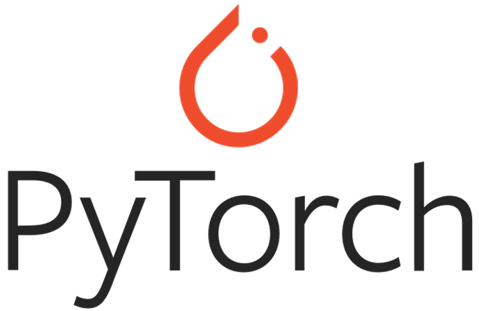
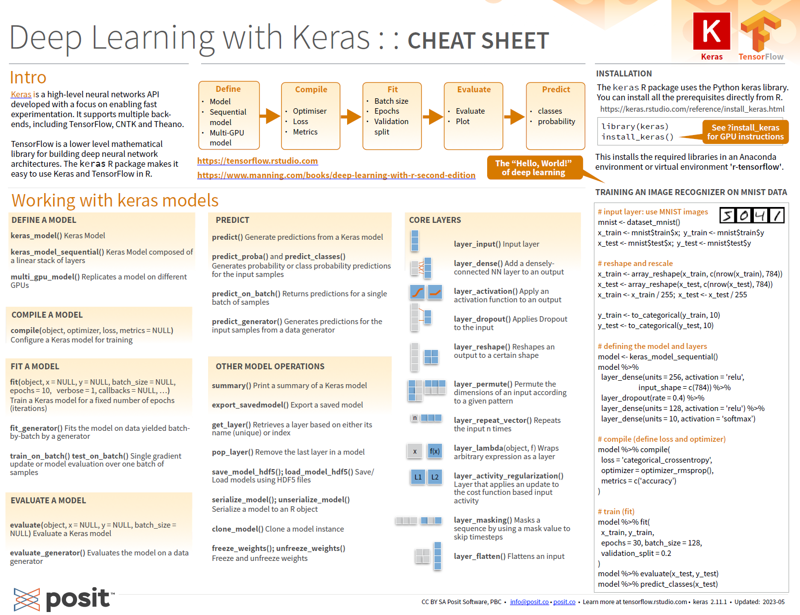
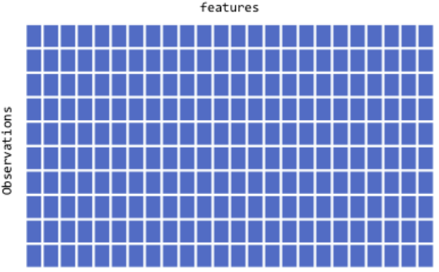
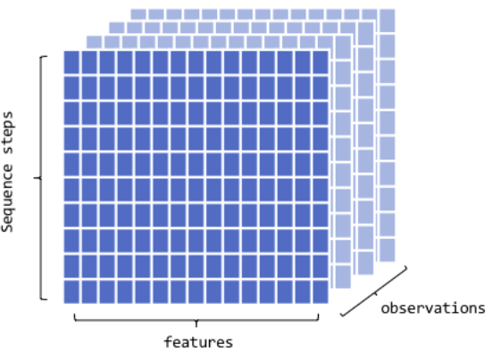
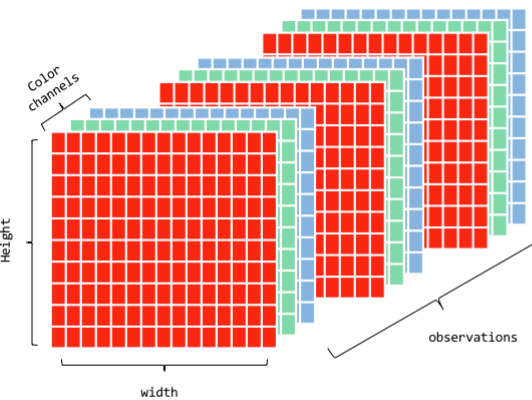
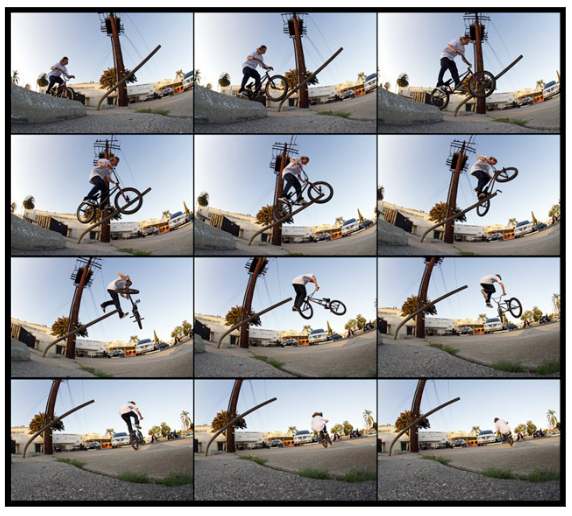
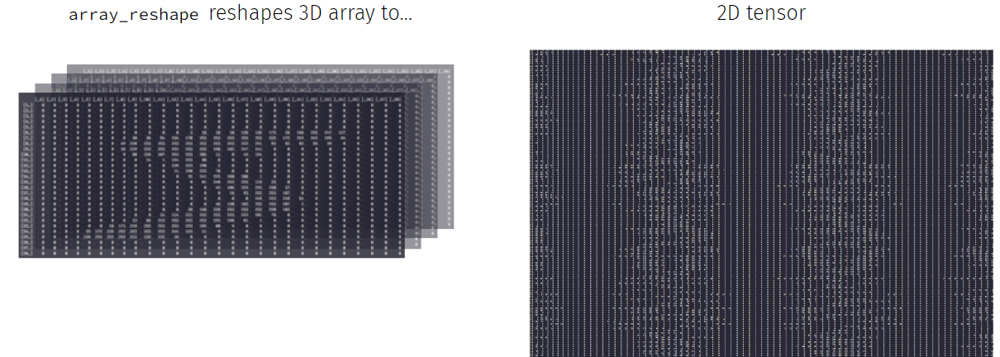

## Deep Learning with R

- We assume familiarity with:

  - Statistical learning basics
    - Classification/Regression problems, 
    - Model building, Model evaluation
  - Deep Neural Networks (even more basic)
    - Artificial neural networks, layers, activation function, gradient methods.

- And we focus on **how to build and use deep neural networks using R**

## Outline

- Which software (and Hw) for Deep Learning
  - Python vs R
  - Tensorflow, Keras, Pytorch and many more
- Deep learning, vectorization and Tensors
  - Vectorization for efficient computation
  - Tensors for data representation and manipulation
- The Machine learning (Dl?) Workflow
  - The general ML workflow
  - A Keras pipeline

## Software for Deep Learning

1. [TensorFlow](https://www.tensorflow.org/)
2. [PyTorch](https://pytorch.org/)
3. [Keras](https://keras.io/)
4. [MXNet](https://mxnet.apache.org/)
5. [Caffe](https://caffe.berkeleyvision.org/)
6. [Theano](https://github.com/Theano/Theano)
7. [Microsoft Cognitive Toolkit (CNTK)](https://docs.microsoft.com/en-us/cognitive-toolkit/)

## [TensorFlow](https://www.tensorflow.org/)

:::: {.columns}

::: {.column width='60%'}

- An open-source deep learning framework 
- Developed by Google 
- with a comprehensive ecosystem of tools and resources for building and deploying machine learning models.

[link to TensorFlow](https://www.tensorflow.org/)
:::

::: {.column width='40%'}


::: {.cell}
::: {.cell-output-display}
{width=100%}
:::
:::


:::

::::

## Pytorch

:::: {.columns}

::: {.column width='60%'}

- Open-source deep learning framework 
- known for its dynamic computational graph feature 
- and user-friendly interface 
- developed by Facebook's AI Research lab.

- [link to PyTorch](https://pytorch.org/)
:::

::: {.column width='40%'}


::: {.cell}
::: {.cell-output-display}
{width=100%}
:::
:::


:::

::::

## Keras

:::: {.columns}

::: {.column width='60%'}

- High-level neural networks API 
- written in Python 
- runs on top of TensorFlow, CNTK, or Theano,
- emphasizes simplicity and ease of use.

- [link to Keras](https://keras.io/)
:::

::: {.column width='40%'}


::: {.cell}
::: {.cell-output-display}
{width=100%}
:::
:::


:::

::::

## Deep learning with R


:::: {.columns}

::: {.column width='60%'}

- As of 2023, common approach is
  - Tensorflow + Keras from within R
  - Using python in the background
  
- Multiple possible installations
- Possibly, the simplest is go to:

  - [TensorFlow for R site](https://tensorflow.rstudio.com/)
  
:::

::: {.column width='40%'}


::: {.cell}
::: {.cell-output-display}
{width=100%}
:::
:::


:::

::::


## The Keras pipeline

- Training and using a model in keras is intended to be done through the usual steps of a ML worfflow


::: {.cell}
::: {.cell-output-display}
{width=410}
:::
:::


<!-- ## Example 1 - A Simple NN -->

<!-- :::: {.columns} -->

<!-- ::: {.column width='55%'} -->

<!-- ```{r, fig.align='center', out.width="100%"} -->
<!-- knitr::include_graphics("images/ASimpleNN-Layers.png") -->
<!-- ``` -->

<!-- ::: -->

<!-- ::: {.column width='45%'} -->

<!-- ```{r, fig.align='center', out.width="80%"} -->
<!-- knitr::include_graphics("images/ASimpleNN-Code.png") -->
<!-- ``` -->

<!-- ::: -->

<!-- :::: -->

## A keras cheat sheet


::: {.cell layout-align="left"}
::: {.cell-output-display}
{fig-align='left' width=100%}
:::
:::

[Available at rstudio github repo](https://github.com/rstudio/cheatsheets/blob/main/keras.pdf)

##  *Hello world* of deep learning (1)


::: {.cell}

```{.r .cell-code}
# load packages
library(keras)
# input layer: use MNIST images
mnist <- dataset_mnist()
x_train <- mnist$train$x; y_train <- mnist$train$y
x_test <- mnist$test$x; y_test <- mnist$test$y
```
:::


##  *Hello world* of deep learning (2)


::: {.cell}

```{.r .cell-code}
# reshape and rescale
x_train <- array_reshape(x_train, c(nrow(x_train), 784))
x_test <- array_reshape(x_test, c(nrow(x_test), 784))
x_train <- x_train / 255; x_test <- x_test / 255
y_train <- to_categorical(y_train, 10)
y_test <- to_categorical(y_test, 10)
```
:::


##  *Hello world* of deep learning (3)


::: {.cell}

```{.r .cell-code}
# defining the model and layers
model <- keras_model_sequential()
model %>%
  layer_dense(units = 256, activation = 'relu', input_shape = c(784)) %>%
  layer_dropout(rate = 0.4) %>%
  layer_dense(units = 128, activation = 'relu') %>%
  layer_dense(units = 10, activation = 'softmax')
```
:::


##  *Hello world* of deep learning (4)


::: {.cell}

```{.r .cell-code}
# compile (define loss and optimizer)
model %>% compile(
  loss = 'categorical_crossentropy',
  optimizer = optimizer_rmsprop(),
  metrics = c('accuracy')
)
```
:::


## *Hello world* of deep learning (5)


::: {.cell}

```{.r .cell-code}
# train (fit)
model %>% fit(
x_train, y_train,
epochs = 30, batch_size = 128,
validation_split = 0.2
)
```
:::


## *Hello world* of deep learning (6)


::: {.cell}

```{.r .cell-code}
model %>% evaluate(x_test, y_test)
predictions <- model %>% predict(x_test)
```
:::


# Tensors

## One must-do digression: Tensors

- Deep learning is filled with the word "tensor",
  - Not to talk of *TensorFlow*

- What are Tensors any way?

  - R users: familiar with  vectors (1-d arrays) and matrices (2-d arrays). 
  - Tensors extend this concept to higher dimensions.
  - Can be seen as multi-dimensional arrays that generalize matrices. 


## Why tensors?

- Working with tensors has many benefits:

  - **Generalization**: Tensors generalize vectors and matrices to an arbitary number of dimensions,
  - **Flexibility**: can hold a wide range of data types.
  - **Speed**: Use of tensors facilitates fast, parallel processing computations.
  
## One and two dimensional tensors

:::: {.columns}

::: {.column width='50%'}

Vectors:rank-1 tensors.

<br>


::: {.cell}
::: {.cell-output-display}
{width=100%}
:::
:::


:::

::: {.column width='50%'}

Matrices: rank-2 tensors.

<br>


::: {.cell}
::: {.cell-output-display}
{width=100%}
:::
:::


:::

::::

## Rank three tensors{.smaller}

:::: {.columns}

::: {.column width='50%'}

- Arrays in layers.

- Typic use: Sequence data
  - time series, text
  - dim = (observations, seq steps, features)

- Examples
  - 250 days of high, low, and current stock price for 390 minutes of trading in a day; dim = c(250, 390, 3)
  - 1M tweets that can be 140 characters long and include 128 unique characters; dim = c(1M, 140, 128)

:::

::: {.column width='50%'}

<br>


::: {.cell}
::: {.cell-output-display}
{width=100%}
:::
:::


:::

::::


## Rank four tensors{.smaller}

:::: {.columns}

::: {.column width='50%'}
- Layers of groups of arrays

- Typic use: Image data

  - RGB channels
  - dim = (observations, height, width, color_depth)
  - MNIST data could be seen as a 4D tensor where color_depth = 1


:::

::: {.column width='50%'}


::: {.cell}
::: {.cell-output-display}
{width=100%}
:::
:::


:::

::::


## Rank five tensors {.smaller}

:::: {.columns}

::: {.column width='50%'}

- Typic use: Video data

  - samples: 4 (each video is 1 minute long)
  - frames: 240 (4 frames/second)
  - width: 256 (pixels)
  - height: 144 (pixels)
  - channels: 3 (red, green, blue)

- Tensor shape (4, 240, 256, 144, 3)

:::

::: {.column width='50%'}

<br>

::: {.cell}
::: {.cell-output-display}
{width=100%}
:::
:::


:::

::::

## One can always *reshape*

- Each DNN model has a given architecture which usually requires 2D/3D tensors.

- If data is not in the expected form it can be *reshaped*.


::: {.cell}
::: {.cell-output-display}
{width=605}
:::
:::


See [Deep learning with R](https://livebook.manning.com/book/deep-learning-with-r-second-edition) for more.

# Hyperparameter tuning

## Tuning hyperparameters of DNN

- Tuning the parameters of a DNN requires 
  - Evaluating distinct combinations at multiple points and 
  - Comparing the quality of the fitted models at each combination.

- This can be manually hand-crafted but some tools such as [Tensorboard](https://www.tensorflow.org/tensorboard) or the `tfruns`package facilitate it.


## The `tfruns` package

- Use the [`tfruns`](https://tensorflow.rstudio.com/tools/tfruns/overview/) package to:

  - Track the hyperparameters, metrics, output, and source code of every training run.
  -  Compare hyperparameters and metrics across runs to find the best performing model.
  -  Automatically generate reports to visualize individual training runs or comparisons between runs.

## A `tfruns` example

- Consider the Keras "Hello World" example,
- To test different sizes for `layer1` and `layer2`:
  - Use the `flags` function to set/change values for hyperparameters to be tuned, here  layer sizes.
  - Modify these values iteratively from outside the run (e.g. the script) that uses each value.
  - Compare the results of having trained the model with the distinct sets of values.
- Implemented in `MNIST_tfruns.r`  and `MNIST_flags.r`

## Example: Setting the flags

In `MNIST_flags.r`:

- Set the flags:


::: {.cell}

```{.r .cell-code}
# set hyperparameter flags
FLAGS <- flags(
  flag_numeric("hl1", 256),
  flag_numeric("hl2", 128)
)
```
:::


- Use the flags:
  

::: {.cell}

```{.r .cell-code}
model %>%
layer_dense(units = FLAGS$hl1, activation = 'relu',
            input_shape = c(784)) %>%
layer_dense(units = FLAGS$hl2, activation = 'relu') %>%
layer_dense(units = 10, activation = 'softmax')
```
:::


## Example: changing flag values

In `MNIST_tfruns.r`:

- Can use a loop to iterate along distinct flag values:


::: {.cell}

```{.r .cell-code}
library(tfruns)

for (hl1 in c(200, 300))
  for (hl2 in c(50, 150))
    training_run('MNIST_flags.r', 
                 flags = c(hl1 = hl1))
```
:::


## Comparing distinct runs:

- The metrics and output of each run are automatically captured within a (unique) `runs` directory 
  
- Some functions to view the results are:
  - `latest run()` shows the results of the last run.
  - `view run("runs/2023-05-15T10-19-47Z")` shows the
results of a given run.

- Some `tfruns` functions available from  Rstudio Addins menu.

## Example: Access comparison results


::: {.cell}

```{.r .cell-code}
# Show last completed run
latest_run()
# Show all runs
ls_runs()
# Show all runs with improved presentation
View(ls_runs())
# show selected items from all runs
ls_runs(metric_val_accuracy > 0.94, 
        order = metric_val_accuracy)
# compare_runs() visual comparison of two training runs. 
compare_runs() # Default is compre two last runs
```
:::


# References and Resources

## References and Resources{.smaller}

### Workshops

- [Deep learning with R *Summer course*](https://bios691-deep-learning-r.netlify.app/)
- [Deep learning with keras and Tensorflow in R (Rstudio conf. 2020)](https://github.com/rstudio-conf-2020/dl-keras-tf)

### Books

- [Deep learning with R, 2nd edition. F. Chollet](https://livebook.manning.com/book/deep-learning-with-r-second-edition)

### Documents

- [7 Best Deep Learning Frameworks To Watch Out For in 2022](https://www.geeksforgeeks.org/7-best-deep-learning-frameworks/)


