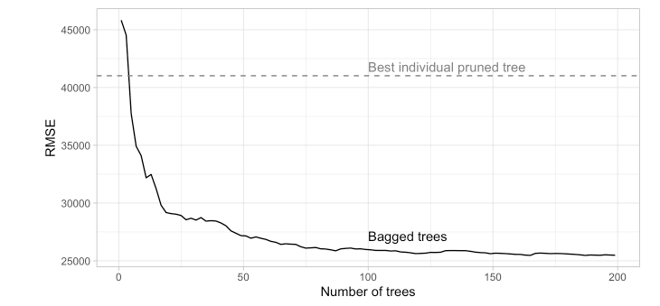
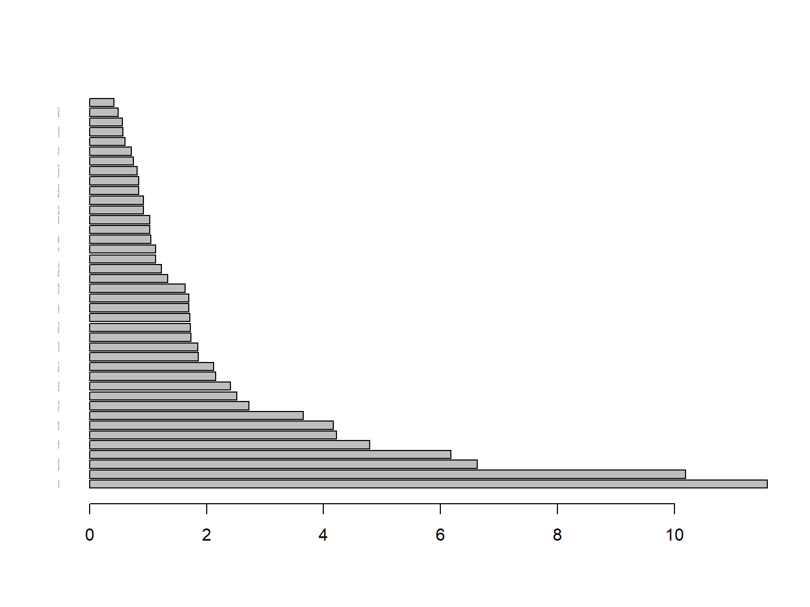
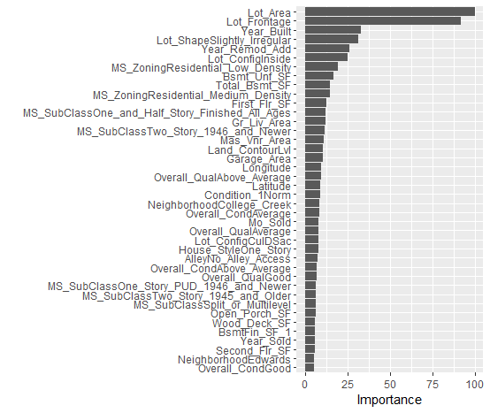
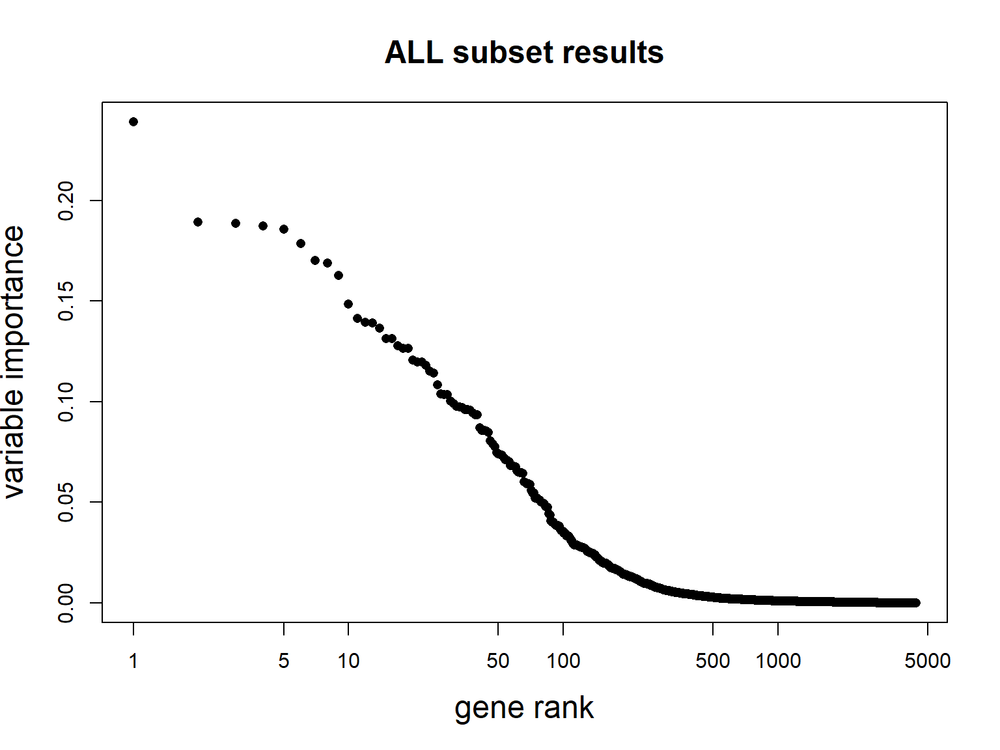

::: {.cell hash='Ensemble-Examples_cache/html/unnamed-chunk-1_afd44ae2ef49b34d1c0aa73a82e463f9'}

```{.r .cell-code}
# Helper packages
library(dplyr)       # for data wrangling
library(ggplot2)     # for awesome plotting
library(doParallel)  # for parallel backend to foreach
library(foreach)     # for parallel processing with for loops

# Modeling packages
library(caret)       # for general model fitting
library(rpart)       # for fitting decision trees
library(ipred)       # for fitting bagged decision trees
```
:::


# Bagging trees

The first example is adapted from [@Boehmke2020], also [available online](https://bradleyboehmke.github.io/HOML/).

This example relies on the `AmesHousing` dataset on house prices in Ames, IA.


::: {.cell hash='Ensemble-Examples_cache/html/unnamed-chunk-2_a9419b574f7e14dcf6d1a9f889de8973'}

```{.r .cell-code}
if(!require(AmesHousing))
  install.packages("AmesHousing", dep=TRUE)
ames <- AmesHousing::make_ames()
```
:::

::: {.cell hash='Ensemble-Examples_cache/html/unnamed-chunk-3_d908a9b47c95803b084a1e813268e6ae'}

```{.r .cell-code}
if(!require(rsample))
  install.packages("rsample", dep=TRUE)
# Stratified sampling with the rsample package
set.seed(123)
split <- rsample::initial_split(ames, prop = 0.7, 
                       strata = "Sale_Price")
ames_train  <- rsample::training(split)
ames_test   <- rsample::testing(split)
```
:::


Building a decision trees to predict the sales price for the Ames housing data yields a poor performance classifier/predictor that is beaten by alternatives such as MARS or KNN (check it!)

In this example, rather than use a single pruned decision tree, we can use, say, 100 bagged unpruned trees (by not pruning the trees we're keeping bias low and variance high which is when bagging will have the biggest effect).

As the below code chunk illustrates, we gain significant improvement over our individual (pruned) decision tree (RMSE of 26,462 for bagged trees vs. 41,019 for the single decision tree).

The `bagging`() function comes from the `ipred` package and we use `nbagg` to control how many iterations to include in the bagged model and `coob=TRUE` indicates to use the OOB error rate.

-   By default, bagging() uses rpart::rpart() for decision tree base learners but other base learners are available.
-   Since bagging just aggregates a base learner, we can tune the base learner parameters as normal.
-   Here, we pass parameters to rpart() with the control parameter and we build deep trees (no pruning) that require just two observations in a node to split.


::: {.cell hash='Ensemble-Examples_cache/html/unnamed-chunk-4_5e13be83e796241efbaabf66688d6d98'}

```{.r .cell-code}
# make bootstrapping reproducible
set.seed(123)

# train bagged model
system.time(
ames_bag1 <- bagging(
  formula = Sale_Price ~ .,
  data = ames_train,
  nbagg = 100,  
  coob = TRUE,
  control = rpart.control(minsplit = 2, cp = 0)
)
)
```

::: {.cell-output .cell-output-stdout}
```
   user  system elapsed 
  38.76    0.25   39.21 
```
:::
:::

Bagging, as most ensemble procedures, can be time consuming.
See [@Boehmke2020](https://bradleyboehmke.github.io/HOML/bagging.html#easily-parallelize) for an example on how to easily parallelize code, and save time.


::: {.cell hash='Ensemble-Examples_cache/html/unnamed-chunk-5_b5a40db5255258355d0e81330504e8ee'}

```{.r .cell-code}
show(ames_bag1)
```

::: {.cell-output .cell-output-stdout}
```

Bagging regression trees with 100 bootstrap replications 

Call: bagging.data.frame(formula = Sale_Price ~ ., data = ames_train, 
    nbagg = 100, coob = TRUE, control = rpart.control(minsplit = 2, 
        cp = 0))

Out-of-bag estimate of root mean squared error:  26216.47 
```
:::
:::


Bagging tends to improve quickly as the number of resampled trees increases, and then it reaches a platform.

The figure below has been produced iterated the computation above over `nbagg` values of 1–200 and applied the `bagging()` function.


::: {.cell layout-align="center" hash='Ensemble-Examples_cache/html/unnamed-chunk-6_60b7339ad517ba5cad71f865f3cd004c'}
::: {.cell-output-display}
{fig-align='center' width=100%}
:::
:::


## Variable importance

Due to the bagging process, models that are normally perceived as interpretable are no longer so. 

However, we can still make inferences about how features are influencing our model using *feature importance* measures based on the sum of the reduction in the loss function (e.g., SSE) attributed to each variable at each split in a given tree.


::: {.cell hash='Ensemble-Examples_cache/html/unnamed-chunk-7_49dd484e0cdcf009d253419b67443ab0'}

```{.r .cell-code}
pred.imp <- varImp(ames_bag1) 
pred.imp$Overall<- pred.imp$Overall/sum(pred.imp$Overall)*100 
  
varImpt <- pred.imp %>%  arrange (desc(Overall)) %>%
  slice(1:40)
head(varImpt, n=10)
```

::: {.cell-output .cell-output-stdout}
```
                 Overall
Lot_Area       11.590497
Lot_Frontage   10.196220
Neighborhood    6.635439
MS_SubClass     6.183734
Year_Built      4.791913
Lot_Shape       4.220695
Lot_Config      4.172808
Year_Remod_Add  3.653528
Overall_Cond    2.723227
Bsmt_Unf_SF     2.521168
```
:::
:::

::: {.cell hash='Ensemble-Examples_cache/html/unnamed-chunk-8_f0b51ada48ac492b6d85699d0094fad4'}

```{.r .cell-code}
barplot(varImpt$Overall, 
        names.arg=row.names(varImpt), cex.names=0.1,
        horiz = TRUE)
```

::: {.cell-output-display}
{width=768}
:::
:::


Alternatively if the tree is built with `caret` the `vip` function from package `vip` can be used.


::: {.cell hash='Ensemble-Examples_cache/html/unnamed-chunk-9_eb0336cb04f62bb1aabec87ac67e00a1'}

```{.r .cell-code}
  system.time(
  ames_bag2 <- train(
    Sale_Price ~ .,
    data = ames_train,
    method = "treebag",
    trControl = trainControl(method = "oob"),
    nbagg = 100,  
    keepX=TRUE,
    control = rpart.control(minsplit = 2, cp = 0)
    )
  )

vip::vip(ames_bag2, num_features = 40)
```
:::

::: {.cell hash='Ensemble-Examples_cache/html/unnamed-chunk-10_ee4d1bcfad8675191bd1e004d0abb515'}

```{.r .cell-code}

```

::: {.cell-output-display}
{width=100%}
:::
:::


## Random forests for gene expression data

Random forest have been particularly successful in Bioinformatics where high dimensional data are common.

One common application has been the use of RF to derive cancer-related classifiers based on gene expression data.

Gene expression data are high dimensional tabular datasets where for each inividual the expression of a high number of genes has been measured

The example uses "RMA-preprocessed gene expression data" obtained by [@Chiaretti2004]. Briefly they consist of:

- 12625 genes (hgu95av2 Affymetrix GeneChip)
- 128 samples (arrays)
- phenotypic data on all 128 patients, including:
- 95 B-cell cancer
- 33 T-cell cancer

A standard bioinformatic preprocessing has been applied.


::: {.cell hash='Ensemble-Examples_cache/html/unnamed-chunk-11_20d7e34a4b44860deaea16cad00e168b'}

```{.r .cell-code}
if(!require(affy)) BiocManager::install("affy")
if(!require(genefilter)) BiocManager::install("genefilter")
if(!require(ALL)) BiocManager::install("ALL")
library(affy)
library(ALL)
data(ALL)
```
:::


Preprocessing is applied to obtain relevant subset of data
Also, keep 30 arrays here JUST for computational convenience #  

::: {.cell hash='Ensemble-Examples_cache/html/unnamed-chunk-12_f58c5ad1cae03156ac4cfb59b9511904'}

```{.r .cell-code}
library(genefilter); 
e.mat <- 2^(exprs(ALL)[,c(81:110)]) 
ffun <- filterfun(pOverA(0.20,100)) 
t.fil <- genefilter(e.mat,ffun) 
small.eset <- log2(e.mat[t.fil,]) 
group <- c(rep('B',15),rep('T',15)) 
dim(small.eset) 
```

::: {.cell-output .cell-output-stdout}
```
[1] 4400   30
```
:::

```{.r .cell-code}
colnames(small.eset)
```

::: {.cell-output .cell-output-stdout}
```
 [1] "43012" "48001" "49006" "57001" "62001" "62002" "62003" "63001" "64001"
[10] "64002" "65005" "68001" "68003" "84004" "LAL5"  "01003" "01007" "02020"
[19] "04018" "09002" "10005" "11002" "12008" "15006" "16002" "16007" "17003"
[28] "18001" "19002" "19008"
```
:::

```{.r .cell-code}
pData(ALL)[81:110,1:5] # column "BT" defines groups
```

::: {.cell-output .cell-output-stdout}
```
        cod  diagnosis  sex age BT
43012 43012  1/15/1999    M  18 B4
48001 48001  3/22/1997    M  19 B2
49006 49006  8/12/1998    F  43 B2
57001 57001  1/29/1997    F  53 B3
62001 62001 11/11/1997    F  50 B4
62002 62002  1/15/1998    M  54 B4
62003 62003  12/4/1998    M  53 B4
63001 63001   7/8/1997    M  49 B1
64001 64001  8/28/1997    M  20 B2
64002 64002 10/21/1997    F  26 B2
65005 65005  7/20/1999    M  22 B2
68001 68001  5/15/1997    M  36 B1
68003 68003  4/11/2000    F  27 B2
84004 84004  9/25/1998    M  50  B
LAL5   LAL5       <NA> <NA>  NA  B
01003  1003  2/18/1997    M  31  T
01007  1007  9/30/1998    F  16 T3
02020  2020  3/23/2000    F  48 T2
04018  4018  3/24/2000    M  17 T2
09002  9002  5/14/1998    F  40 T3
10005 10005  9/30/1997    M  22 T2
11002 11002 12/23/1996    M  30  T
12008 12008  3/22/1997    M  18 T4
15006 15006  6/10/1998    M  22 T2
16002 16002  4/10/1997    M  50 T3
16007 16007  11/1/1998    M  41 T3
17003 17003   4/8/1997    F  40  T
18001 18001  4/23/1997    F  28 T2
19002 19002  1/29/1997    M  25 T3
19008 19008  4/29/1998    F  16 T2
```
:::
:::


We use the `randomForest` library to build an "out-of-the box" classifier.


::: {.cell hash='Ensemble-Examples_cache/html/unnamed-chunk-13_d7b2b6bd074dadcf255d71edd1a22d0c'}

```{.r .cell-code}
if (!require(randomForest)) install.packages("randomForest", dep=TRUE)
library(randomForest) 
set.seed(1234) 
system.time(
rf <- randomForest(x=t(small.eset),
                   y=as.factor(group),
                   ntree=10000) 
)
```

::: {.cell-output .cell-output-stdout}
```
   user  system elapsed 
  12.12    0.00   12.16 
```
:::
:::


Inspect the results


::: {.cell hash='Ensemble-Examples_cache/html/unnamed-chunk-14_d7dd72d8fb293ef1b963ce1eba5a5366'}

```{.r .cell-code}
rf
```

::: {.cell-output .cell-output-stdout}
```

Call:
 randomForest(x = t(small.eset), y = as.factor(group), ntree = 10000) 
               Type of random forest: classification
                     Number of trees: 10000
No. of variables tried at each split: 66

        OOB estimate of  error rate: 0%
Confusion matrix:
   B  T class.error
B 15  0           0
T  0 15           0
```
:::
:::


Now look at variable importance:


::: {.cell hash='Ensemble-Examples_cache/html/unnamed-chunk-15_24f549e78a41485d915d16fb1d62e863'}

```{.r .cell-code}
imp.temp <- abs(rf$importance[,]) 
t <- order(imp.temp,decreasing=TRUE)
plot(c(1:nrow(small.eset)),imp.temp[t],log='x',cex.main=1.5,    xlab='gene rank',ylab='variable importance',cex.lab=1.5,    pch=16,main='ALL subset results')  
```

::: {.cell-output-display}
{width=768}
:::
:::


Or, a better plot:


::: {.cell hash='Ensemble-Examples_cache/html/unnamed-chunk-16_ac0b4a049d262f2e7c5b9c33024996ca'}

```{.r .cell-code}
varImpPlot(rf, n.var=25, main='ALL Subset Results') 
```

::: {.cell-output-display}
{width=768}
:::
:::


We can focus on the 25 most important genes


::: {.cell hash='Ensemble-Examples_cache/html/unnamed-chunk-17_8d0b487ab185e1199a96217de055b26d'}

```{.r .cell-code}
gn.imp <- names(imp.temp)[t] 
gn.25 <- gn.imp[1:25] 
# vector of top 25 genes, in order
```
:::


We use the Bioinformatics Bioconductor libraries to find out more about these these genes. Information on how to do it can be found at [https://aspteaching.github.io/An-Introduction-to-Pathway-Analysis-with-R-and-Bioconductor/](https://aspteaching.github.io/An-Introduction-to-Pathway-Analysis-with-R-and-Bioconductor/).


::: {.cell hash='Ensemble-Examples_cache/html/unnamed-chunk-18_017068c8bba0ee29a9dc464bd9622854'}

```{.r .cell-code}
if(!require(hgu95av2.db)) BiocManager::install("hgu95av2.db")
if(!require(AnnotationDbi)) BiocManager::install("AnnotationDbi")
library(hgu95av2.db)
geneAnots <- AnnotationDbi::select(hgu95av2.db, gn.25,
                      c("SYMBOL", "GENENAME"))
head(geneAnots, n=25)
```

::: {.cell-output .cell-output-stdout}
```
      PROBEID   SYMBOL
1    37344_at  HLA-DMA
2    35016_at     CD74
3    37039_at  HLA-DRA
4    33238_at      LCK
5    38319_at     CD3D
6    38949_at    PRKCQ
7    38147_at   SH2D1A
8   2059_s_at      LCK
9  41723_s_at HLA-DRB5
10 41723_s_at HLA-DRB1
11 41723_s_at HLA-DRB3
12 41723_s_at HLA-DRB4
13 41723_s_at HLA-DRB6
14   41609_at  HLA-DMB
15   38242_at     BLNK
16 32794_g_at   TRBV19
17 32794_g_at  TRBV7-2
18 32794_g_at  TRBV6-5
19 32794_g_at  TRBV5-4
20 32794_g_at  TRBV3-1
21 32794_g_at    TRBC2
22 32794_g_at    TRBC1
23   39723_at     CUL1
24 38095_i_at HLA-DPB1
25   38314_at      CIC
                                                             GENENAME
1                major histocompatibility complex, class II, DM alpha
2                                                       CD74 molecule
3                major histocompatibility complex, class II, DR alpha
4                      LCK proto-oncogene, Src family tyrosine kinase
5                        CD3 delta subunit of T-cell receptor complex
6                                              protein kinase C theta
7                                            SH2 domain containing 1A
8                      LCK proto-oncogene, Src family tyrosine kinase
9               major histocompatibility complex, class II, DR beta 5
10              major histocompatibility complex, class II, DR beta 1
11              major histocompatibility complex, class II, DR beta 3
12              major histocompatibility complex, class II, DR beta 4
13 major histocompatibility complex, class II, DR beta 6 (pseudogene)
14                major histocompatibility complex, class II, DM beta
15                                                      B cell linker
16                                   T cell receptor beta variable 19
17                                  T cell receptor beta variable 7-2
18                                  T cell receptor beta variable 6-5
19                                  T cell receptor beta variable 5-4
20                                  T cell receptor beta variable 3-1
21                                    T cell receptor beta constant 2
22                                    T cell receptor beta constant 1
23                                                           cullin 1
24              major histocompatibility complex, class II, DP beta 1
25                                  capicua transcriptional repressor
```
:::
:::


To end the exploration we plot  heatmap that shows how the two groups differ in gene expression.


::: {.cell hash='Ensemble-Examples_cache/html/unnamed-chunk-19_a56853c646b1928391b14f352a474359'}

```{.r .cell-code}
t <- is.element(rownames(small.eset),gn.25) 
sig.eset <- small.eset[t,]    
# matrix of expression values, not necessarily in order  
library(RColorBrewer) 
hmcol <- colorRampPalette(brewer.pal(11,"PuOr"))(256) 
colnames(sig.eset) <- group 
# This will label the heatmap columns 
csc <- rep(hmcol[50],30) 
csc[group=='T'] <- hmcol[200]    
# column side color will be purple for T and orange for B 
heatmap(sig.eset,scale="row", col=hmcol,ColSideColors=csc) 
```

::: {.cell-output-display}
{width=768}
:::
:::


# References

